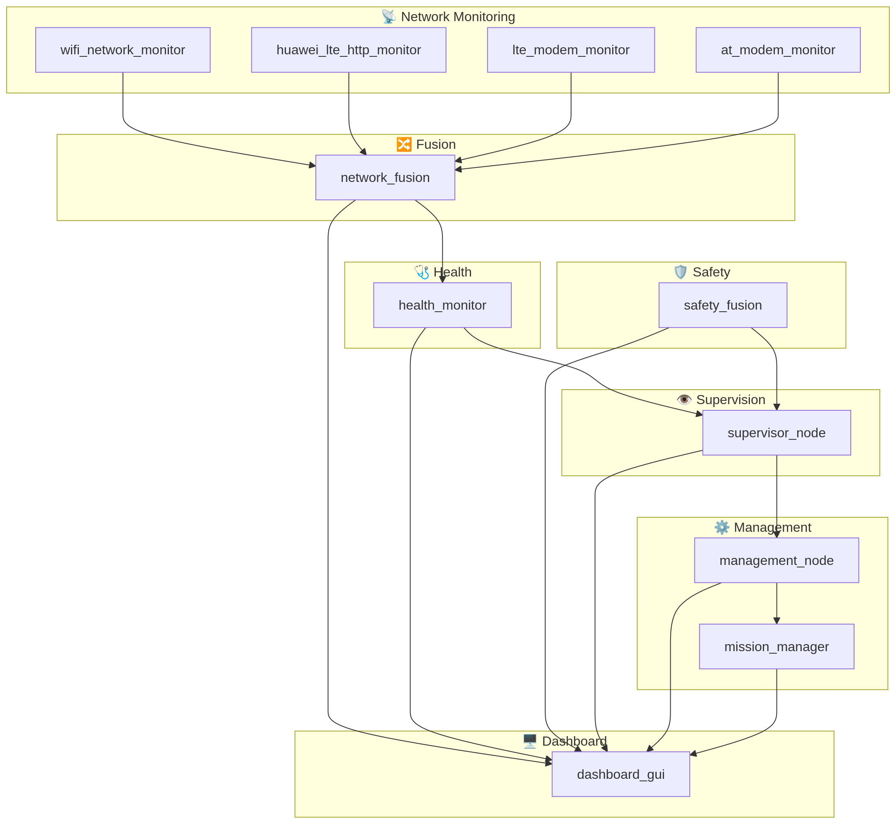

# 🚁 Flying Robot ROS 2 Workspace

[](https://docs.ros.org/)
[](https://en.cppreference.com/w/cpp/17)
[](LICENSE)

This repository contains a **modular ROS 2 workspace** for flying robot network monitoring, health supervision, safety fusion, mission management, and dashboard visualization.

The workspace is organized into **independent reusable packages** so each node can be used in other robot systems without depending on one large monolithic application.

---

## 🎯 Project Purpose

The goal of this workspace is to provide reusable modules for:

- Wi-Fi monitoring
- LTE / 5G monitoring
- Network fusion
- Health monitoring
- Safety fusion
- Supervisor decision-making
- Management and mission control
- Mission phase control
- Dashboard visualization

Each package has one clear responsibility and can be tested separately.

---

## 🏗️ Basic System Architecture



### Data Flow
1. Network monitor nodes publish Wi-Fi, LTE, and AT modem state.
2. `network_fusion` combines all network states into one result.
3. `health_monitor` checks whether nodes and topics are alive.
4. `supervisor_node` makes high-level decisions.
5. `management_node` controls mission and maintenance behavior.
6. `mission_manager` handles mission phase transitions.
7. `dashboard_gui` displays the full system status.

---

## 📦 Workspace Packages

| Package | Purpose |
|---|---|
| `wifi_network_monitor` | Monitors Wi-Fi state, SSID, and link speed |
| `huawei_lte_http_monitor` | Monitors Huawei LTE stick through HiLink HTTP API |
| `lte_modem_monitor` | Monitors LTE interface/modem |
| `at_modem_monitor` | Monitors modem using AT commands |
| `network_fusion` | Combines multiple network links into one status |
| `health_monitor` | Checks liveness of nodes and topics |
| `safety_fusion` | Produces safe/unsafe status |
| `supervisor_node` | Makes system-level decisions |
| `management_node` | Handles mission and maintenance control |
| `mission_manager` | Controls mission phase transitions |
| `dashboard_gui` | Displays system status |

---

## 📁 Workspace Structure

```text
ros2_ws/
├── README.md
├── .gitignore
├── docs/
│   └── architecture.png
├── src/
│   ├── wifi_network_monitor/
│   ├── huawei_lte_http_monitor/
│   ├── lte_modem_monitor/
│   ├── at_modem_monitor/
│   ├── network_fusion/
│   ├── health_monitor/
│   ├── safety_fusion/
│   ├── supervisor_node/
│   ├── management_node/
│   ├── mission_manager/
│   └── dashboard_gui/
├── build/
├── install/
└── log/
```
---

## 🔄 Design Philosophy

This workspace follows a modular and reusable approach:

    Each folder inside src/ is one package
    Each package has one responsibility
    Each package can be built independently
    Each package has its own README.md
    Core logic is separated from project-specific code

This makes the system easier to:

    understand
    maintain
    extend
    reuse in other robots
    test on different hardware
    
---

## 🚀 Build the Workspace

From the workspace root:

Bash

cd ~/ros2_ws
colcon build
source install/setup.bash

To build only one package:

Bash

colcon build --packages-select wifi_network_monitor

---

## ▶️ Run Example Nodes

Bash

ros2 run wifi_network_monitor wifi_monitor_node
ros2 run huawei_lte_http_monitor at_hilink_adapter_node
ros2 run lte_modem_monitor lte_monitor_node
ros2 run at_modem_monitor at_modem_monitor_node
ros2 run network_fusion network_fusion_node
ros2 run health_monitor health_monitor_node
ros2 run safety_fusion safety_fusion_node
ros2 run supervisor_node supervisor_node
ros2 run management_node management_node
ros2 run mission_manager mission_manager_node
ros2 run dashboard_gui dashboard_node

---

## 🧩 Reusability

Every package in this workspace is designed so that another student can:

    Copy the package into their own ROS 2 workspace
    Edit only the project-specific plugin file
    Build with colcon
    Use it immediately

---

## 📌 Notes

    Use underscores in package names.
    Keep the README.md in each package folder.
    Keep this top-level README as the entry point to the whole repository.
    Do not commit build/, install/, or log/ folders.

---

## 📄 License

MIT License
