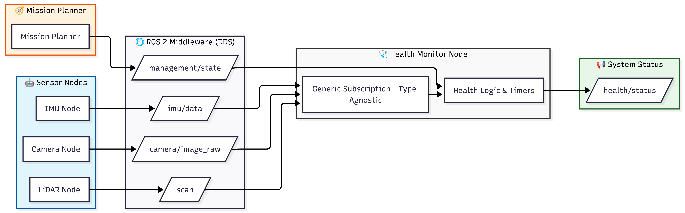

# 🩺 ROS 2 Generic Health Monitor Node

[](https://docs.ros.org/)
[](https://en.cppreference.com/w/cpp/17)

A high-performance, reusable, and type-agnostic ROS 2 node designed to monitor the liveliness and health of robotic subsystems.

Unlike standard monitoring nodes that hardcode subscriber types directly into the source file, this package follows a strict **Template Engine + Implementation Plug-in** architecture. It uses **C++ Class Templates** and the **Factory Design Pattern** to allow any future project to reuse the core monitoring logic without modifying a single line of the engine.

---

## 🏗️ System Architecture

The node sits between the hardware drivers and the high-level system controllers, aggregating topic health without consuming high CPU loads.



### Data Flow Overview
1. **Sensor Nodes (Blue):** Standard ROS 2 drivers publishing their data (Camera, LiDAR, IMU).
2. **Mission Planner (Orange):** Informs the monitor of *planned* inactivity (e.g., turning off the camera to save battery).
3. **Health Monitor Node (Grey):** Tracks DDS middleware leases and message arrival rates against the configured QoS rules.
4. **System Status (Green):** Outputs a unified `health/status` message used by safety controllers downstream.

---

## 📂 Repository Architecture (The Template Pattern)

This package is split into two distinct layers to enforce separation of concerns:

```
health_monitor_pkg/
├── include/
│   └── health_monitor_pkg/
│       └── health_monitor_node.hpp     ← 🧠 THE REUSABLE ENGINE
├── src/
│   └── health_monitor_node.cpp         ← 🚁 PROJECT-SPECIFIC PLUGIN
├── config/
│   └── health_monitor_params.yaml
├── CMakeLists.txt
└── package.xml
```

| File | Role | Modify when... |
| :--- | :--- | :--- |
| `.hpp` (Header) | Contains the templated class `HealthMonitorNode<T>` with all monitoring logic. | **Never.** This is the locked engine. |
| `.cpp` (Source) | Inherits the template and registers specific sensor message types. | **Adding/removing sensor types** for your project. |
| `.yaml` (Config) | Defines monitor IDs, timeouts, and QoS settings. | **Runtime tuning** without rebuilding. |

---

## ✨ Key Features & Academic Requirements

This package was explicitly designed to be a **reusable template** for any robotics project:

* **🧬 Compile-Time Polymorphism:** The entire node is built as a C++ template (`HealthMonitorNode<HealthStatusMsg, ManagementStateMsg>`). Swap output interface messages at compile-time without rewriting the core logic.
* **🏭 Factory Design Pattern:** A `register_message_type<T>()` method allows new sensor types to be registered at runtime, replacing the old `if/else if` ladder. This satisfies the **Open/Closed Principle** — open for extension, closed for modification.
* **🧠 Context-Aware Health:** By subscribing to `/management/state`, the monitor distinguishes between a hardware failure ("ERROR") and an intentional shutdown ("INACTIVE - Mission Not Required").
* **🛡️ Hard DDS QoS Enforcement:** Hooks directly into the ROS 2 DDS middleware to catch `deadline_missed` and `liveliness_lost` events the exact millisecond they happen.

---

## 🚀 Quick Start

### 1. Build the Workspace
Open a terminal in your ROS 2 workspace root (e.g., `~/ros2_ws`):
```
colcon build --packages-select health_monitor_pkg
source install/setup.bash
```

### 2. Run the Node
Launch the node using the provided launch file, which automatically loads the YAML configuration:
```
ros2 launch health_monitor_pkg health_monitor.launch.py
```

---

## ⚙️ Configuration Guide

Editing `config/health_monitor_params.yaml` allows you to add new sensors without recompiling, as long as their message type is already registered in the `.cpp` plug-in.

### Example Configuration
```yaml
health_monitor_node:
  ros__parameters:
    check_period_ms: 100
    status_publish_period_ms: 1000
    monitor_ids: ["camera", "lidar", "imu"]

    # --- Camera ---
    camera.node_name: "camera_node"
    camera.topic_name: "/camera/image_raw"
    camera.kind: "data"
    camera.message_type: "image"
    camera.reliability: "best_effort"
    camera.timeout_ms: 500

    # --- LiDAR ---
    lidar.node_name: "lidar_node"
    lidar.topic_name: "/scan"
    lidar.kind: "data"
    lidar.message_type: "laser_scan"
    lidar.reliability: "reliable"
    lidar.deadline_ms: 100
    lidar.timeout_ms: 500

    # --- IMU ---
    imu.node_name: "imu_node"
    imu.topic_name: "/imu/data"
    imu.kind: "heartbeat"
    imu.message_type: "twist_stamped"
    imu.reliability: "reliable"
    imu.deadline_ms: 20
    imu.liveliness_ms: 100
    imu.timeout_ms: 250
```

### Parameter Definitions
| Parameter | Description |
| :--- | :--- |
| `message_type` | String key that maps to a registered C++ type in the `.cpp` plugin. |
| `reliability` | `reliable` or `best_effort`. Must match the publisher's QoS. |
| `timeout_ms` | Software timer. Reports `STALE` if no message arrives within this window. |
| `deadline_ms` | Hard DDS QoS. Triggers an error instantly via middleware callback. |
| `liveliness_ms` | DDS Lease Duration. Detects publisher death without polling. |

---

## 🧑‍💻 Reusability Guide (For Future Projects)

This package proves true reusability. To use the Health Monitor in a completely different project (e.g., an autonomous tractor), **you do not modify the `.hpp` engine.**

### Step 1: Include the Template Engine
```cpp
#include "health_monitor_pkg/health_monitor_node.hpp"
#include "tractor_msgs/msg/soil_moisture.hpp"
#include "tractor_msgs/msg/blade_position.hpp"
```

### Step 2: Create a New Implementation Plug-in
```cpp
class TractorHealthMonitor : public health_monitor_pkg::HealthMonitorNode<>
{
protected:
  void register_user_message_types() override
  {
    register_message_type<tractor_msgs::msg::SoilMoisture>("soil_moisture");
    register_message_type<tractor_msgs::msg::BladePosition>("blade_position");
  }
};

int main(int argc, char ** argv) {
  rclcpp::init(argc, argv);
  rclcpp::spin(std::make_shared<TractorHealthMonitor>());
  rclcpp::shutdown();
  return 0;
}
```

### Step 3 (Optional): Override the Interface Message Type
If your project uses different output messages:
```cpp
using TractorMonitor = health_monitor_pkg::HealthMonitorNode<
  tractor_msgs::msg::FarmHealth,
  tractor_msgs::msg::FieldManagementState>;
```

That's it. **Zero modifications** to the original `.hpp` engine.

---

## 📡 Topic Interfaces

### Subscribed Topics
* **/<sensor_topic>** *(Type-agnostic)* — Dynamic subscriptions created based on the YAML file.
* **/management/state** *(ManagementState)* — Incoming commands regarding planned subsystem shutdowns.

### Published Topics
* **/health/status** *(HealthStatus)* — Aggregated health heartbeat.

#### Output Status Codes
| Code | Name | Meaning |
| :---: | :--- | :--- |
| 0 | **OK** | Topic publishing nominally within QoS bounds. |
| 1 | **STALE** | Topic violated `timeout_ms` or DDS `deadline_ms`. |
| 2 | **INACTIVE** | Topic silent, but authorized by the Mission Planner. |
| 3 | **UNKNOWN** | Node booted up; hasn't received its very 1st message yet. |
| 4 | **ERROR** | Hard DDS failure (Liveliness lost / Incompatible QoS matched). |

---

## 🎓 Design Patterns Used (Academic Reference)

| Pattern | Implementation | Benefit |
| :--- | :--- | :--- |
| **Template Method** | `HealthMonitorNode<T>` class template | Compile-time message type swapping |
| **Factory Method** | `register_message_type<T>()` | Runtime sensor registration |
| **Strategy Pattern** | Lambda callbacks in subscription factories | Per-monitor behavior customization |
| **Observer Pattern** | DDS QoS event callbacks | Reactive failure detection |

---

## 📄 License
MIT License. Free to use for academic and commercial projects.
