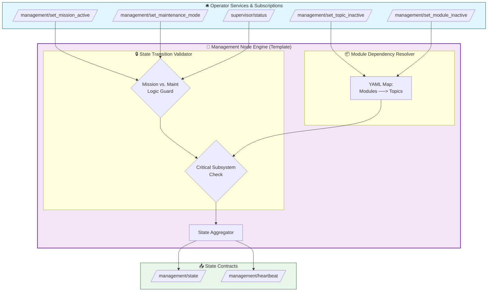

# 🧭 ROS 2 Generic Management Node

[](https://docs.ros.org/)
[](https://en.cppreference.com/w/cpp/17)

A high-performance, reusable, and type-agnostic ROS 2 state management node. It acts as the mission controller and system configuration vault, coordinating subsystem modes (e.g., active missions, maintenance sleep cycles) and resolving topic-to-module dependencies dynamically.

Unlike standard monolithic managers, this package uses a strict **Header-Only Template Engine + Implementation Source** architecture. This lets developers change message and service types, configure complex module/topic hierarchies via YAML, and deploy the node on completely different robotic platforms without touching the core validation math.

---

## 🏗️ System Architecture

The management node acts as the central coordinator of system configurations, receiving requests from the operator or ground control and publishing state contracts to safety and health monitors.



### Data Flow Overview
1. **Operator Services (Blue):** Ground control or higher-level autonomous planners invoke ROS 2 services to change system states (enable maintenance, sleep specific camera modules, start missions).
2. **Transition Validation Engine (Grey):** Evaluates requests against safety rules. For example, it will instantly reject starting a mission if a critical LiDAR topic is inactive, or reject enabling maintenance mode while a mission is active.
3. **Module-to-Topic Resolver:** Automatically expands high-level module shutdowns (e.g., "lidar") to its constituent lower-level topics (e.g., `/scan`, `/lidar/nearest_obstacle`) utilizing configuration mappings.
4. **State Contracts (Green):** Publishes the verified system status to `/management/state`, allowing the watchdog system (Health Monitor) to silence warnings for planned offline devices.

---

## 📂 Repository Architecture (The Template Pattern)

The package enforces strict decoupling between the underlying system management logic and project-specific message implementations:

```text
management_pkg/
├── include/
│   └── management_pkg/
│       └── management_node.hpp       ← 🧠 THE REUSABLE ENGINE (Header-Only)
├── src/
│   └── management_node.cpp           ← 🚁 PROJECT-SPECIFIC PLUGIN
├── msg/
│   └── ManagementState.msg           ← 📨 Custom State Message
├── srv/
│   ├── SetTopicInactive.srv          ← 🛎️ Custom Service Interfaces
│   └── SetModuleInactive.srv
├── config/
│   └── management_params.yaml        ← ⚙️ Subsystem/Topic Declarations
├── launch/
│   └── management.launch.py
├── CMakeLists.txt
└── package.xml
```

| File | Role | Modify when... |
| :--- | :--- | :--- |
| `.hpp` (Header) | Defines state transition machines, validation logic, and service handlers. | **Never.** This is the locked template engine. |
| `.cpp` (Source) | Instantiates the template with concrete types. | **Re-templating** for alternative message formats. |
| `.msg` / `.srv` | Custom structural definition for state and service payloads. | **Altering the interface contracts.** |
| `.yaml` (Config) | Defines module identities, topic memberships, and criticality flags. | **Adding sensors/actuators** to your robot. |

---

## ✨ Key Features & Academic Requirements

This package satisfies rigorous modern software design requirements:

* **🧬 Compile-Time Polymorphism:** Built as a C++ template class `ManagementNode<StateMsg, SupervisorMsg, TopicSrv, ModuleSrv>`. This allows the node to adapt to arbitrary interfaces across different robotic projects.
* **🛡️ Open-Closed State Machine:** Transition rules are closed for modification to prevent unsafe edge cases (e.g., unauthorized active missions), but open for modular extensions via YAML configurations.
* **📦 Subsystem Isolation (Module Maps):** Users can define abstract "Modules" in YAML, listing all associated topics. Marking a module inactive automatically propagates inactive contracts to all associated topic watchdogs in the pipeline.
* **💓 DDS Middleware Heartbeat:** Broadcasts its own heartbeat with dedicated Deadline and Liveliness QoS, enabling redundant watchdogs to verify that the mission coordinator is active and responding.

---

## 🚀 Quick Start

### 1. Build the Workspace
Compile the custom message/service interfaces and the template node:
```bash
cd ~/ros2_ws
colcon build --packages-select management_pkg
source install/setup.bash
```

### 2. Run the Node
Launch the node, loading the YAML module/criticality configurations automatically:
```bash
ros2 launch management_pkg management.launch.py
```

### 3. Verify Active State
```bash
ros2 topic echo /management/state
```

---

## ⚙️ Configuration Guide (`management_params.yaml`)

Subsystems are defined entirely in configuration. You can mark a module as `critical: true` to prevent any mission from beginning if that module (or any of its topics) is marked inactive.

```yaml
management_node:
  ros__parameters:
    # Watchdog monitor parameters
    supervisor_status_topic: "/supervisor/status"
    supervisor_status_timeout_ms: 1000
    
    # Declarations of high-level sub-modules on the vehicle
    module_ids: ["lidar", "navigation"]
    
    # --- Module 1: LiDAR ---
    lidar.critical: true
    lidar.topics: 
      - "/scan"
      - "/lidar/nearest_obstacle"
    
    # --- Module 2: Navigation ---
    navigation.critical: true
    navigation.topics: 
      - "/vehicle/velocity"
```

---

## 📋 Interface Definitions

### `msg/ManagementState.msg`
```text
std_msgs/Header header
bool maintenance_mode
bool mission_active
string[] planned_inactive_topics
string[] planned_inactive_topic_reasons
string[] planned_inactive_modules
string[] planned_inactive_module_reasons
uint8 reason
string message

uint8 REASON_NONE = 0
uint8 REASON_MAINTENANCE_MODE = 1
uint8 REASON_PLANNED_INACTIVE = 2
```

### `srv/SetTopicInactive.srv`
```text
string topic_name
bool inactive
string reason
---
bool success
string message
```

### `srv/SetModuleInactive.srv`
```text
string module_name
bool inactive
string reason
---
bool success
string message
```

---

## 🧑‍💻 Reusability Guide (For Future Projects)

To use this management engine on an underwater vehicle (AUV) using a custom `auv_interfaces` package, **do not change the header file**. Simply create a new implementation source file:

```cpp
#include "management_pkg/management_node.hpp"
#include "auv_interfaces/msg/sub_state.hpp"
#include "auv_interfaces/srv/set_device_off.hpp"

// Re-template the class using AUV-specific interfaces
class AuvStateManager : public management_pkg::ManagementNode<
  auv_interfaces::msg::SubState,
  drone_health_interfaces::msg::SupervisorStatus, // Reused supervisor msg
  auv_interfaces::srv::SetDeviceOff               // Reused custom service
>
{
public:
  AuvStateManager() : ManagementNode() {}
};

int main(int argc, char ** argv)
{
  rclcpp::init(argc, argv);
  rclcpp::spin(std::make_shared<AuvStateManager>());
  rclcpp::shutdown();
  return 0;
}
```

---

## 📡 Topic & Service Interfaces

### Subscribed Topics
| Topic | Message Type | Description |
| :--- | :--- | :--- |
| `/supervisor/status` | `drone_health_interfaces/SupervisorStatus` | Monitors commands and safety states before starting missions. |

### Published Topics
| Topic | Message Type | Description |
| :--- | :--- | :--- |
| `/management/state` | `management_pkg/ManagementState` | Consolidated mode contract sent to watchdog watchpoints. |
| `/management/heartbeat` | `std_msgs/String` | Node heartbeat with active DDS deadline and liveliness QoS. |

### Offered Services
| Service | Service Type | Description |
| :--- | :--- | :--- |
| `/management/set_maintenance_mode` | `std_srvs/SetBool` | Toggles safe diagnostic/service mode configurations. |
| `/management/set_mission_active` | `std_srvs/SetBool` | Arms/disarms the mission flag after validating safety status. |
| `/management/set_topic_inactive` | `management_pkg/SetTopicInactive` | Temporarily sleeps/silences a single topic sentinel. |
| `/management/set_module_inactive` | `management_pkg/SetModuleInactive` | Temporarily sleeps/silences a whole subsystem group. |

---

## 🎓 Design Patterns Used (Academic Reference)

| Pattern | Implementation | Benefit |
| :--- | :--- | :--- |
| **Template Method** | `class ManagementNode<T, U, V, W>` | Compile-time custom data-type bindings |
| **Facade Pattern** | Module-to-Topic parameter definitions | Groups complex subsystem endpoints under single commands |
| **State Pattern** | Mission vs. Maintenance rule evaluations | Prevents illegal state transitions at runtime |
| **Observer Pattern** | Supervisor status tracking | Keeps autonomous arming decisions safety-aware |

---

## 📄 License
MIT License. Free to use for academic and commercial projects.
