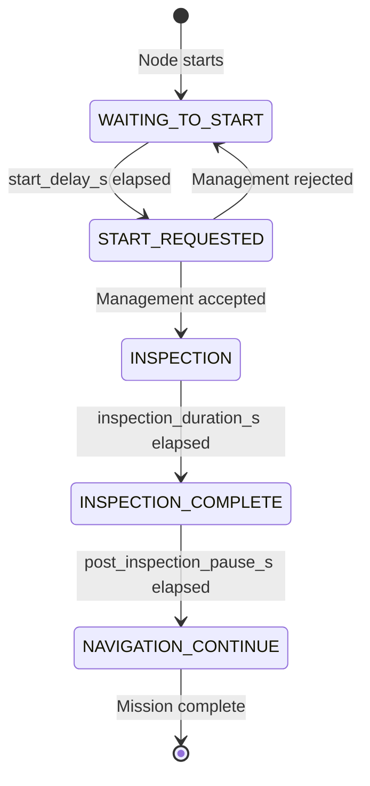
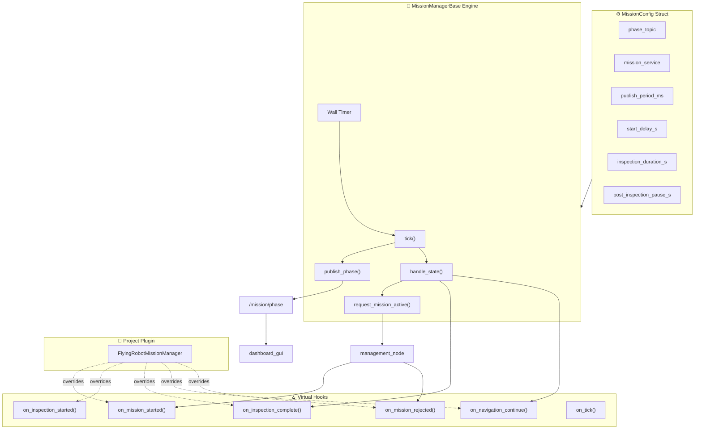

# 🎯 ROS 2 Reusable Mission Manager Node

[](https://docs.ros.org/)
[](https://en.cppreference.com/w/cpp/17)

A reusable ROS 2 node that manages mission phases and communicates with the management node for mission activation.

Follows a strict **Template Engine + Implementation Plug-in** architecture.

---

## 📂 Package Structure

```text
mission_manager/
├── include/
│   └── mission_manager/
│       └── mission_manager_base.hpp   ← 🧠 THE REUSABLE ENGINE (never modify)
├── src/
│   └── mission_manager_node.cpp       ← 🚁 PROJECT-SPECIFIC PLUGIN (edit this)
├── CMakeLists.txt
└── package.xml
```

| File | Role | Modify when |
| :--- | :--- | :--- |
| `.hpp` Header | Contains `MissionConfig`, `MissionState`, and `MissionManagerBase` engine | **Never** |
| `.cpp` Source | Inherits the base and overrides hooks | **Every new project** |

---

## 🏗️ System Architecture

### State Machine



### Data Flow



---

## 🚀 Quick Start

### Build the Package
```bash
cd ~/ros2_ws
colcon build --packages-select mission_manager
source install/setup.bash
```

### Run the Node
```bash
ros2 run mission_manager mission_manager_node
```

---

## ⚙️ Configuration Guide

All configuration is done at compile time via `MissionConfig` in the plugin constructor.

| Field | Default | Description |
| :--- | :--- | :--- |
| `phase_topic` | `/mission/phase` | Topic for publishing current phase |
| `mission_service` | `/management/set_mission_active` | Service to activate mission |
| `publish_period_ms` | `500` | How often to publish phase in ms |
| `start_delay_s` | `5` | Seconds before requesting mission |
| `inspection_duration_s` | `50` | Duration of inspection phase |
| `post_inspection_pause_s` | `2.0` | Pause after inspection before continuing |

---

## 🧑‍💻 Reusability Guide

### Step 1: Include the Engine
```cpp
#include "mission_manager/mission_manager_base.hpp"
```

### Step 2: Create Your Plugin
```cpp
class TractorMissionManager : public mission_manager::MissionManagerBase
{
public:
  TractorMissionManager()
  : MissionManagerBase("tractor_mission", build_config()) {}

protected:
  void on_inspection_started() override
  {
    // Activate soil moisture sensor
  }

  void on_inspection_complete() override
  {
    // Save soil data to file
  }

private:
  static mission_manager::MissionConfig build_config()
  {
    mission_manager::MissionConfig cfg;
    cfg.phase_topic           = "/tractor/mission/phase";
    cfg.start_delay_s         = 3;
    cfg.inspection_duration_s = 120;
    return cfg;
  }
};
```

**Zero modifications** to the original engine.

---

## 📡 Topic Interfaces

### Published Topics

| Topic | Type | Values |
| :--- | :--- | :--- |
| `/mission/phase` | `std_msgs/String` | `IDLE`, `INSPECTION`, `INSPECTION_COMPLETE`, `NAVIGATION_CONTINUE` |

### Service Clients

| Service | Type | Purpose |
| :--- | :--- | :--- |
| `/management/set_mission_active` | `std_srvs/SetBool` | Request mission activation |

---

## 🎓 Design Patterns Used

| Pattern | Implementation | Benefit |
| :--- | :--- | :--- |
| **Template Method** | `MissionManagerBase` with virtual hooks | Reusable state machine |
| **Strategy Pattern** | `phase_string()` virtual method | Custom phase naming |
| **State Pattern** | `MissionState` enum + `handle_state()` | Clean state transitions |
| **Observer Pattern** | Async service callbacks | Non-blocking activation |

---

## 📄 License

MIT License. Free to use for academic and commercial projects.
