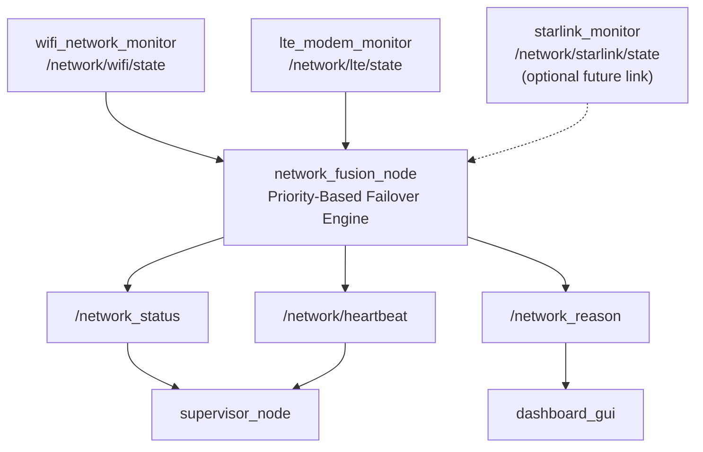
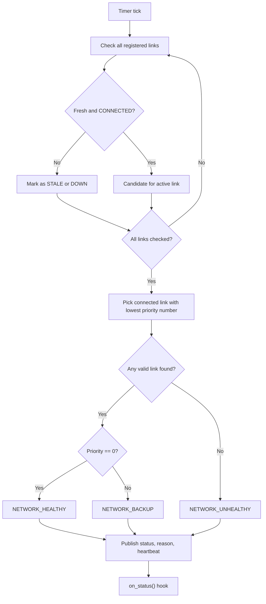

# 🔀 network_fusion – Truly Reusable Network Failover Node for ROS 2

[](https://docs.ros.org/)
[](https://en.cppreference.com/w/cpp/17)

A lightweight, **truly reusable** ROS 2 node that fuses **any number of network links** (Wi-Fi, LTE, Starlink, etc.) and performs automatic **priority-based failover**.

Unlike hardcoded fusion nodes, this engine lets the plugin register links dynamically using `add_link()`, so you can add, remove, or rename links **without modifying a single line of the engine**.

---

## 🏗️ System Architecture



### Data Flow Overview

1. **Link Monitors** publish independent connection states.
2. **`network_fusion_node`** subscribes to all registered links, checks freshness, and selects the active link by priority.
3. **Status Outputs** publish:
   - overall network status
   - detailed reason string
   - heartbeat
4. **Consumers** such as the Supervisor and Dashboard use these outputs for decision-making and visualisation.

---

## 🔁 Priority-Based Failover Logic



### Failover Rules

- A link is only valid if:
  - its latest message is **fresh**
  - its state is `"CONNECTED"`
- The engine chooses the valid link with the **lowest priority number**
- `priority = 0` means **primary**
- Higher numbers mean **fallback order**

### Freshness Protection

Each link must publish within `freshness_timeout_s()` seconds, otherwise it is marked as **STALE**.

This prevents the system from trusting a dead monitor that has stopped publishing.

---

## 📂 Repository Architecture (Template Pattern)

```text
network_fusion/
├── include/
│   └── network_fusion/
│       └── network_fusion_base.hpp   ← 🧠 THE REUSABLE ENGINE
├── src/
│   └── network_fusion_node.cpp       ← 🚁 PROJECT-SPECIFIC PLUGIN
├── docs/
│   ├── architecture.mmd              ← Mermaid system diagram source
│   └── failover_logic.mmd            ← Mermaid failover diagram source
├── CMakeLists.txt
├── package.xml
└── README.md
```

| File | Role | Modify when... |
| :--- | :--- | :--- |
| `network_fusion_base.hpp` | Contains `NetworkFusionBase` with `add_link()`, timer, freshness checks, and failover logic | **Never.** This is the locked engine |
| `network_fusion_node.cpp` | Registers links via `add_link()` and overrides hooks | **Every time** you add/remove a link or change priorities |

---

## ✨ Key Features

- **🧬 Dynamic Link Registration**  
  Register any number of links using `add_link(name, topic, priority)`

- **🥇 Priority-Based Failover**  
  The connected link with the lowest priority number becomes active automatically

- **⏱️ Anti-Stale Freshness Guard**  
  Links must publish within the freshness timeout window

- **🛡️ DDS Heartbeat QoS**  
  Uses `deadline` and `liveliness` QoS for failure detection

- **🚫 Zero External Dependencies**  
  No YAML, no custom messages, no custom services — only standard `std_msgs`

---

## 🚀 Quick Start

### 1. Build the Package

```bash
cd ~/ros2_ws
colcon build --packages-select network_fusion
source install/setup.bash
```

### 2. Run the Node

```bash
ros2 run network_fusion network_fusion_node
```

> This node expects the individual link monitors (such as `wifi_network_monitor` and `lte_modem_monitor`) to already be running.

---

## ⚙️ Configuration Guide

All configuration is done in the plugin file:

```bash
src/network_fusion_node.cpp
```

No YAML is required.

### Registering Links

```cpp
MyNetworkFusion() : NetworkFusionBase("my_network_fusion")
{
  // add_link(display_name, topic_name, priority)
  add_link("WIFI",     "/network/wifi/state",     0);  // primary
  add_link("LTE",      "/network/lte/state",      1);  // first backup
  add_link("STARLINK", "/network/starlink/state", 2);  // second backup
}
```

### Available Hooks

| Hook | Purpose | Default |
| :--- | :--- | :--- |
| `freshness_timeout_s()` | Maximum age before a link is marked stale | `10.0` |
| `on_status(status, active)` | Called after each publish cycle | No action |

---

## 🧑‍💻 Reusability Guide

To adapt the fusion logic for a different robot, **you do not modify the `.hpp` engine**.

### Step 1: Include the Template Engine

```cpp
#include "network_fusion/network_fusion_base.hpp"
```

### Step 2: Register Your Links and Override Hooks

```cpp
class TractorNetworkFusion : public network_fusion::NetworkFusionBase
{
public:
  TractorNetworkFusion() : NetworkFusionBase("tractor_network_fusion")
  {
    add_link("ETHERNET",  "/tractor/eth/state", 0);
    add_link("WIFI",      "/tractor/wifi/state", 1);
    add_link("SATELLITE", "/tractor/sat/state", 2);
  }

protected:
  double freshness_timeout_s() const override
  {
    return 5.0;
  }

  void on_status(const std::string & status, const std::string & active) override
  {
    if (status == "NETWORK_UNHEALTHY") {
      RCLCPP_ERROR(get_logger(), "All links down — stopping tractor!");
    }
  }
};

int main(int argc, char ** argv)
{
  rclcpp::init(argc, argv);
  rclcpp::spin(std::make_shared<TractorNetworkFusion>());
  rclcpp::shutdown();
  return 0;
}
```

That is it. **Zero modifications** to the original engine.

---

## 📡 Topic Interfaces

### Subscribed Topics

Subscribed topics are **dynamic** and are defined by `add_link()`.

| Example Topic | Type | Description |
| :--- | :--- | :--- |
| `/network/wifi/state` | `std_msgs/String` | Wi-Fi connection state |
| `/network/lte/state` | `std_msgs/String` | LTE connection state |
| `/network/starlink/state` | `std_msgs/String` | Starlink connection state (optional) |

### Published Topics

| Topic | Type | Example Data | Description |
| :--- | :--- | :--- | :--- |
| `/network_status` | `std_msgs/String` | `"NETWORK_HEALTHY"` | Aggregated network health |
| `/network_reason` | `std_msgs/String` | `"WIFI=CONNECTED,LTE=STALE,ACTIVE_CONNECTION=WIFI"` | Detailed link report |
| `/network/heartbeat` | `std_msgs/String` | `"network_fusion_node alive"` | Liveliness heartbeat |

---

## 📘 Output Status Codes

| Status | Meaning |
| :--- | :--- |
| `NETWORK_HEALTHY` | Primary link (`priority = 0`) is connected |
| `NETWORK_BACKUP` | Primary is down, but a fallback link is active |
| `NETWORK_UNHEALTHY` | No valid link is available |

---

## ❤️ Heartbeat QoS

| Setting | Value |
| :--- | :--- |
| Deadline | 5 s |
| Liveliness lease | 8 s |
| Liveliness mode | Manual by topic |

---

## 🎓 Design Patterns Used

| Pattern | Implementation | Benefit |
| :--- | :--- | :--- |
| **Template Method** | `NetworkFusionBase` with virtual hooks | Reusable skeleton with project-specific extension |
| **Factory Method** | `add_link()` dynamic subscription creation | Runtime link registration |
| **Strategy Pattern** | Priority-based selection + `on_status()` | Swap failover behaviour without engine changes |
| **Observer Pattern** | DDS liveliness + topic subscriptions | Reactive failure detection |

---

## 🗂️ Related Modules

- `wifi_network_monitor` – publishes `/network/wifi/state`
- `lte_modem_monitor` – publishes `/network/lte/state`
- `supervisor_node` – consumes `/network_status`
- `dashboard_gui` – displays `/network_reason`

---

## 📄 License

MIT License. Free to use for academic and commercial projects.
