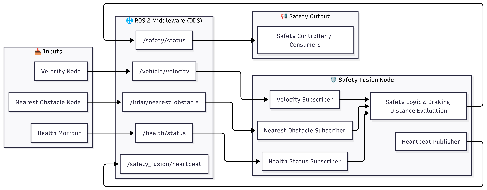

# 🛡️ ROS 2 Generic Safety Fusion Node

[](https://docs.ros.org/)
[](https://en.cppreference.com/w/cpp/17)

A reusable, type-agnostic ROS 2 node that fuses real-time obstacle distance, vehicle velocity, and system health status to compute dynamic braking requirements and output a unified Safety Status.

Unlike traditional safety nodes that tightly couple kinematic math to specific ROS 2 message types, this package uses the **Extractor Lambda Design Pattern** alongside **C++ Class Templates**. The core mathematical engine has zero knowledge of what sensor messages look like. Instead, the user injects lightweight lambda functions that extract raw floats from any arbitrary message type.

---

## 🏗️ System Architecture

The node sits downstream of both the sensor drivers and the Health Monitor, acting as the final safety gate before autonomous action.



### Data Flow Overview
1. **Obstacle Sensor:** Publishes distance to the nearest obstacle (e.g., LiDAR, Ultrasonic, Depth Camera).
2. **Velocity Sensor:** Publishes the current vehicle speed (e.g., IMU, Wheel Odometry, GPS).
3. **Health Monitor:** Publishes the health status of all monitored topics to `/health/status`.
4. **Safety Fusion Node:** Receives all three inputs, computes the required braking clearance using kinematic equations, cross-checks system health, and publishes a final `SAFE` / `UNSAFE` / `UNKNOWN` verdict to `/safety/status`.
5. **Heartbeat:** Publishes its own heartbeat to `/safety_fusion/heartbeat` so the Health Monitor can verify the Safety Fusion Node itself is alive.

---

## 📂 Repository Architecture (The Template Pattern)

This package is split into two distinct layers to enforce separation of concerns:

```
safety_fusion_pkg/
├── include/
│   └── safety_fusion_pkg/
│       └── safety_fusion_node.hpp      ← 🧠 THE REUSABLE ENGINE (Math + Health Logic)
├── src/
│   └── safety_fusion_node.cpp          ← 🚁 PROJECT-SPECIFIC PLUGIN (Your Sensors)
├── msg/
│   └── SafetyStatus.msg                ← 📨 Custom Output Message
├── config/
│   └── safety_fusion_params.yaml       ← ⚙️ Runtime Configuration
├── launch/
│   └── safety_fusion.launch.py
├── CMakeLists.txt
└── package.xml
```

| File | Role | Modify when... |
| :--- | :--- | :--- |
| `.hpp` (Header) | Contains the templated class `SafetyFusionNode<T>` with all kinematic math, health validation, and heartbeat logic. | **Never.** This is the locked engine. |
| `.cpp` (Source) | Inherits the template and injects project-specific sensor extractors via lambdas. | **Changing sensor types** for your project. |
| `.msg` (Message) | Defines the output `SafetyStatus` message structure. | **Adding new output fields.** |
| `.yaml` (Config) | Defines topics, physics parameters, and heartbeat timing. | **Runtime tuning** without rebuilding. |

---

## ✨ Key Features & Academic Requirements

* **🧬 Compile-Time Polymorphism:** The node is built as a C++ template (`SafetyFusionNode<HealthStatusMsg, SafetyStatusMsg>`). Swap both input and output interface messages at compile-time without rewriting the core logic.
* **🔌 Extractor Lambda Pattern:** Instead of hardcoding `msg->data` or `msg->twist.linear.x`, the user passes a lambda function that extracts a `float` from any message type. The engine never knows what a `TwistStamped` or `Float32` is.
* **🧠 Health-Aware Safety:** The node subscribes to `/health/status` from the Health Monitor. If any required sensor topic is unhealthy (STALE, ERROR, UNKNOWN), the Safety Fusion Node automatically forces the system into `UNSAFE`, regardless of how close the nearest obstacle is.
* **💓 Self-Monitoring Heartbeat:** Publishes its own heartbeat with DDS deadline and liveliness QoS, so the Health Monitor can detect if the Safety Fusion Node itself crashes.
* **📐 Kinematic Braking Math:** Computes required clearance dynamically using configurable deceleration, reaction time, and safety margin.

---

## 🚀 Quick Start

### 1. Build the Workspace
```
colcon build --packages-select safety_fusion_pkg
source install/setup.bash
```

### 2. Run the Node
```
ros2 launch safety_fusion_pkg safety_fusion.launch.py
```

### 3. Watch the Output
```
ros2 topic echo /safety/status
```

---

## 📐 Safety Math

The node evaluates safety at a configurable frequency (default 10Hz) using the following kinematic formula:

```
Required Clearance = Braking Distance + Reaction Distance + Safety Margin

Where:
  Braking Distance  = v² / (2 × max_deceleration)
  Reaction Distance = v × reaction_time
  Safety Margin     = constant (configurable)
```

**Decision Logic:**

| Condition | Output State | Output Reason |
| :--- | :--- | :--- |
| Missing obstacle or velocity data | `UNKNOWN` | `REASON_WAITING_FOR_INPUTS` |
| Invalid sensor values (NaN, negative) | `UNKNOWN` | `REASON_INVALID_INPUT` |
| Health Monitor reports unhealthy topic | `UNSAFE` | `REASON_HEALTH_UNSAFE` |
| Health Monitor itself stopped publishing | `UNSAFE` | `REASON_HEALTH_UNSAFE` |
| Obstacle distance ≤ Required Clearance | `UNSAFE` | `REASON_INSUFFICIENT_BRAKING_DISTANCE` |
| Obstacle distance > Required Clearance | `SAFE` | `REASON_NONE` |

---

## ⚙️ Configuration Guide

Edit `config/safety_fusion_params.yaml` to tune the physics, topics, and timing.

### Example Configuration
```yaml
safety_fusion_node:
  ros__parameters:
    # --- Topic Names ---
    nearest_obstacle_topic: "/lidar/nearest_obstacle"
    velocity_topic: "/vehicle/velocity"
    health_status_topic: "/health/status"
    safety_status_topic: "/safety/status"
    heartbeat_topic: "/safety_fusion/heartbeat"

    # --- Health Validation ---
    required_health_topics:
      - "/lidar/nearest_obstacle"
      - "/vehicle/velocity"
    health_status_timeout_ms: 1500

    # --- Physics Parameters ---
    evaluation_period_ms: 100
    max_deceleration_mps2: 1.5
    reaction_time_s: 0.2
    safety_margin_m: 0.5

    # --- Heartbeat QoS ---
    heartbeat_period_ms: 500
    heartbeat_deadline_ms: 700
    heartbeat_liveliness_ms: 1500
```

### Parameter Definitions
| Parameter | Description |
| :--- | :--- |
| `nearest_obstacle_topic` | Topic publishing the distance to the nearest obstacle (meters). |
| `velocity_topic` | Topic publishing the current vehicle speed (m/s). |
| `health_status_topic` | Topic where the Health Monitor publishes health reports. |
| `required_health_topics` | List of topics that MUST be healthy for `SAFE` output. |
| `health_status_timeout_ms` | If no health message arrives within this window, force `UNSAFE`. |
| `max_deceleration_mps2` | Maximum braking deceleration the vehicle can achieve (m/s²). |
| `reaction_time_s` | Time delay between detecting an obstacle and applying brakes (seconds). |
| `safety_margin_m` | Extra buffer distance added to the required clearance (meters). |
| `heartbeat_period_ms` | How often the node publishes its own heartbeat. |
| `heartbeat_deadline_ms` | DDS deadline for the heartbeat. Must be > `heartbeat_period_ms`. |
| `heartbeat_liveliness_ms` | DDS liveliness lease. Must be > `heartbeat_deadline_ms`. |

### Timing Rule
```
heartbeat_period_ms < heartbeat_deadline_ms < heartbeat_liveliness_ms
```
The node will throw a startup error if this rule is violated.

---

## 📨 SafetyStatus.msg

```
uint8 SAFE=0
uint8 UNSAFE=1
uint8 DEGRADED=2
uint8 UNKNOWN=3

uint8 REASON_NONE=0
uint8 REASON_INSUFFICIENT_BRAKING_DISTANCE=1
uint8 REASON_HEALTH_UNSAFE=2
uint8 REASON_INVALID_INPUT=3
uint8 REASON_WAITING_FOR_INPUTS=4

std_msgs/Header header

uint8 state
uint8 reason

float32 nearest_obstacle_m
float32 speed_mps
float32 braking_distance_m
float32 reaction_distance_m
float32 required_clearance_m
float32 effective_deceleration_mps2
float32 safety_margin_m
```

---

## 🧑‍💻 Reusability Guide (For Future Projects)

To use the Safety Fusion engine in a completely different project (e.g., a self-driving car using `nav_msgs/Odometry` for velocity), **you do not modify the `.hpp` engine.**

### Step 1: Include the Template Engine
```cpp
#include "safety_fusion_pkg/safety_fusion_node.hpp"
#include "nav_msgs/msg/odometry.hpp"
#include "sensor_msgs/msg/range.hpp"
```

### Step 2: Create a New Implementation Plug-in
```cpp
class CarSafetyFusion : public safety_fusion_pkg::SafetyFusionNode<>
{
public:
  CarSafetyFusion() : SafetyFusionNode<>()
  {
    // Extract speed from Odometry instead of TwistStamped
    register_velocity_subscription<nav_msgs::msg::Odometry>(
      velocity_topic_,
      rclcpp::QoS(rclcpp::KeepLast(10)).reliable(),
      [](const nav_msgs::msg::Odometry::SharedPtr msg) -> float {
        return static_cast<float>(msg->twist.twist.linear.x);
      });

    // Extract obstacle distance from Range instead of Float32
    register_obstacle_subscription<sensor_msgs::msg::Range>(
      nearest_obstacle_topic_,
      rclcpp::QoS(rclcpp::KeepLast(10)).reliable(),
      [](const sensor_msgs::msg::Range::SharedPtr msg) -> float {
        return msg->range;
      });
  }
};

int main(int argc, char ** argv) {
  rclcpp::init(argc, argv);
  rclcpp::spin(std::make_shared<CarSafetyFusion>());
  rclcpp::shutdown();
  return 0;
}
```

### Step 3 (Optional): Override the Interface Message Types
If your project uses different health and safety message types:
```cpp
using CarSafety = safety_fusion_pkg::SafetyFusionNode<
  autodrive_msgs::msg::VehicleHealth,
  autodrive_msgs::msg::VehicleSafetyReport>;
```

That's it. **Zero modifications** to the original `.hpp` engine.

---

## 📡 Topic Interfaces

### Subscribed Topics
| Topic | Type | Description |
| :--- | :--- | :--- |
| `/<obstacle_topic>` | *(User-defined via lambda)* | Distance to nearest obstacle in meters. |
| `/<velocity_topic>` | *(User-defined via lambda)* | Current vehicle speed in m/s. |
| `/health/status` | `HealthStatus` | Health reports from the Health Monitor node. |

### Published Topics
| Topic | Type | Description |
| :--- | :--- | :--- |
| `/safety/status` | `SafetyStatus` | Final safety verdict with braking calculations. |
| `/safety_fusion/heartbeat` | `std_msgs/String` | Heartbeat with DDS deadline and liveliness QoS. |

---

## 🎓 Design Patterns Used (Academic Reference)

| Pattern | Implementation | Benefit |
| :--- | :--- | :--- |
| **Template Method** | `SafetyFusionNode<T, U>` class template | Compile-time interface swapping |
| **Extractor Lambda** | `register_obstacle_subscription<T>(lambda)` | Decouple math from message parsing |
| **Observer Pattern** | Health status subscription | Reactive health-aware decisions |
| **Strategy Pattern** | Configurable physics parameters via YAML | Runtime behavior customization |
| **Heartbeat Pattern** | DDS deadline + liveliness QoS | Self-monitoring liveness proof |

---

## 📄 License
MIT License. Free to use for academic and commercial projects.
