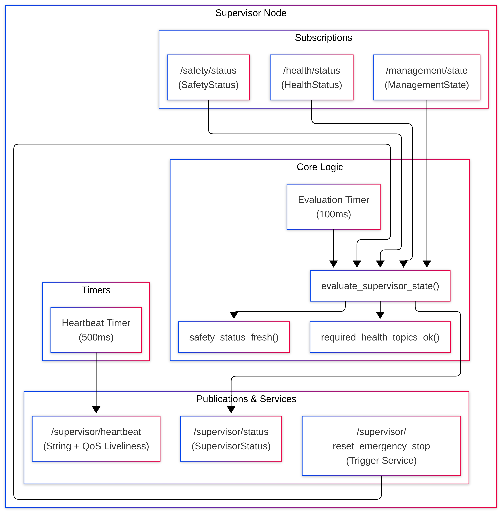
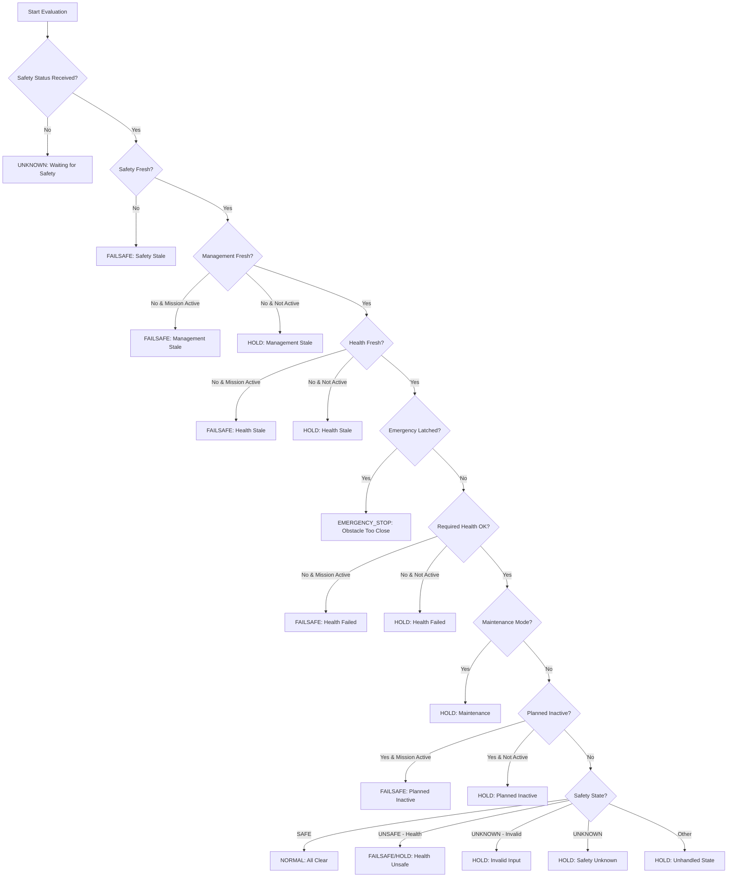

# 🛡️ ROS 2 Generic Supervisor Node

[](https://docs.ros.org/)
[](https://en.cppreference.com/w/cpp/17)

A high-availability, mission-aware ROS 2 node that aggregates safety, health, and management state to produce a single authoritative **SupervisorStatus** for downstream flight controllers. This node serves as the final decision gate before any autonomous action, ensuring that the system only operates within verified safe conditions.

Unlike monolithic supervision nodes that hardcode topic names and decision logic, this package follows a **Priority-Ordered Decision Tree Architecture** combined with **State Latching Patterns**. The core engine is fully configurable via YAML parameters, making it reusable across any robotic platform.

---

## 🏗️ System Architecture

The Supervisor sits at the highest layer of the drone's software stack, fusing signals from safety, health, and mission management into a single authoritative command gate.



### Data Flow Overview
1. **Safety Fusion Node:** Publishes real-time safety status (SAFE / UNSAFE / UNKNOWN) with obstacle proximity information.
2. **Health Monitor Node:** Publishes per-topic health status (OK / STALE / ERROR / INACTIVE / UNKNOWN).
3. **Mission Management Node:** Publishes mission state including maintenance mode, active mission flag, and planned inactive topics.
4. **Supervisor Node:** Receives all three inputs, applies a strict priority-ordered decision tree, latches critical events, and publishes an authoritative `SupervisorStatus` to downstream flight controllers.
5. **Heartbeat:** Publishes its own heartbeat to `/supervisor/heartbeat` with DDS deadline and liveliness QoS so external watchdogs can monitor the Supervisor's own health.

---

## 📂 Repository Architecture

This package follows the same clean separation pattern as the Safety Fusion and Health Monitor packages:

```
supervisor_pkg/
├── include/
│   └── supervisor_pkg/
│       └── supervisor_node.hpp         ← 🧠 THE REUSABLE DECISION ENGINE
├── src/
│   └── supervisor_node_main.cpp        ← 🚁 PROJECT-SPECIFIC PLUGIN
├── msg/
│   └── SupervisorStatus.msg            ← 📨 Custom Output Message
├── config/
│   └── supervisor_params.yaml          ← ⚙️ Runtime Configuration
├── launch/
│   └── supervisor.launch.py
├── CMakeLists.txt
└── package.xml
```

| File | Role | Modify when... |
| :--- | :--- | :--- |
| `.hpp` (Header) | Contains the `SupervisorNode` class with full decision logic, QoS setup, latching, and all evaluation methods. | **Never.** This is the locked engine. |
| `.cpp` (Source) | Contains `main()` and instantiates the node. Optionally subclass for project-specific extensions. | **Adding custom override hooks** for your project. |
| `.msg` (Message) | Defines the output `SupervisorStatus` message structure. | **Adding new output fields** (rarely needed). |
| `.yaml` (Config) | Defines topic names, timeouts, required health topics, and heartbeat timing. | **Runtime tuning** without rebuilding. |

---

## ✨ Key Features & Academic Requirements

* **🛡️ Latched Emergency Stop:** Once triggered by an insufficient braking distance from the Safety Fusion node, the lock persists until a service call explicitly resets it under verified-safe conditions. This prevents race conditions where transient clear signals could accidentally resume operations near obstacles.
* **🧠 Mission-Aware Escalation:** The supervisor intelligently distinguishes between ground and airborne states. When `mission_active` is `true`, stale inputs escalate to `FAILSAFE` instead of `HOLD` — protecting an airborne drone vs. a parked one where degraded operation is acceptable.
* **🚦 Priority-Ordered Decision Tree:** Checks are evaluated in strict priority: Safety → Management → Health → Emergency → Maintenance → Planned Inactive → Normal. The first matching condition wins, ensuring the most severe condition always takes precedence.
* **🛠️ Planned Inactivity Support:** Integrates with the Management State to allow operators to intentionally disable specific subsystems during powered operations. Planned inactive topics are tracked by both topic name and reason, providing full traceability.
* **🩺 Health Cross-Checking:** Validates that all required health topics are reporting `OK` and are not planned as inactive. If the Health Monitor reports any required topic as `STALE`, `ERROR`, or `UNKNOWN`, the Supervisor escalates immediately.
* **📡 DDS-Level Heartbeat:** Manual-by-topic liveliness assertion with deadline and lease duration enforcement. The node calls `assert_liveliness()` on every heartbeat tick, ensuring external monitors can detect Supervisor crashes within milliseconds.

---

## 🚀 Quick Start

### 1. Build the Workspace
```bash
colcon build --packages-select supervisor_pkg
source install/setup.bash
```

### 2. Run the Node
```bash
ros2 launch supervisor_pkg supervisor.launch.py
```

### 3. Watch the Output
```bash
ros2 topic echo /supervisor/status
```

### 4. Reset a Latched Emergency Stop
```bash
ros2 service call /supervisor/reset_emergency_stop std_srvs/srv/Trigger
```

---

## 🚦 Decision Priority Tree (Top-Down)

The supervisor evaluates checks in the following strict order. The **first matching condition wins** and determines the output state:



### Output States and Their Meanings

| Mode | `command_allowed` | Meaning | Typical Action |
| :---: | :---: | :--- | :--- |
| **NORMAL** (0) | `true` | All systems nominal | Full operation allowed |
| **HOLD** (1) | `false` | Degraded but safe | Pause mission, return to hover |
| **FAILSAFE** (2) | `false` | Unsafe during active mission | Immediate landing / emergency stop |
| **EMERGENCY_STOP** (3) | `false` | Latched obstacle event | Hard stop, requires manual reset |
| **UNKNOWN** (4) | `false` | Boot state | Wait for initial safety message |

### Reason Codes

| Code | Name | Trigger Condition |
| :---: | :--- | :--- |
| 0 | **REASON_NONE** | Normal operation |
| 1 | **REASON_WAITING_FOR_SAFETY** | No safety status received yet |
| 2 | **REASON_SAFETY_STATUS_STALE** | Safety status exceeded timeout |
| 3 | **REASON_SAFETY_UNKNOWN** | Safety status is UNKNOWN |
| 4 | **REASON_HEALTH_UNSAFE** | Safety reports health as unsafe |
| 5 | **REASON_OBSTACLE_TOO_CLOSE** | Emergency stop latched |
| 6 | **REASON_INVALID_SAFETY_INPUT** | Invalid safety status input |
| 7 | **REASON_REQUIRED_HEALTH_FAILED** | Required health topic failed |
| 8 | **REASON_HEALTH_STATUS_STALE** | Health status stream timed out |
| 9 | **REASON_MAINTENANCE_MODE** | System in maintenance mode |
| 10 | **REASON_PLANNED_INACTIVE** | Required topic planned inactive |
| 11 | **REASON_MANAGEMENT_STATUS_STALE** | Management state stream timed out |

---

## ⚙️ Configuration Guide

Edit `config/supervisor_params.yaml` to tune topics, timeouts, and heartbeat behavior.

### Example Configuration
```yaml
supervisor_node:
  ros__parameters:
    # --- Topic Names ---
    safety_status_topic: "/safety/status"
    health_status_topic: "/health/status"
    supervisor_status_topic: "/supervisor/status"
    management_state_topic: "/management/state"
    heartbeat_topic: "/supervisor/heartbeat"

    # --- Timing Parameters ---
    evaluation_period_ms: 100
    safety_status_timeout_ms: 500
    health_status_timeout_ms: 1500
    management_state_timeout_ms: 1500

    # --- Required Health Topics ---
    required_health_topics:
      - "/lidar/nearest_obstacle"
      - "/vehicle/velocity"
      - "/camera/image_raw"

    # --- Heartbeat QoS ---
    heartbeat_period_ms: 500
    heartbeat_deadline_ms: 700
    heartbeat_liveliness_ms: 1500
```

### Parameter Definitions

| Parameter | Description |
| :--- | :--- |
| `safety_status_topic` | Topic where Safety Fusion publishes its status. |
| `health_status_topic` | Topic where Health Monitor publishes per-topic health. |
| `supervisor_status_topic` | Topic where this node publishes its authority verdict. |
| `management_state_topic` | Topic where Mission Management publishes state flags. |
| `heartbeat_topic` | Topic for the DDS-level liveliness heartbeat. |
| `evaluation_period_ms` | How often the decision tree runs (default: 100ms). |
| `safety_status_timeout_ms` | Max age of safety status before considered stale. |
| `health_status_timeout_ms` | Max age of health status before considered stale. |
| `management_state_timeout_ms` | Max age of management state before considered stale. |
| `required_health_topics` | Topics that MUST be `OK` for `NORMAL` mode. |
| `heartbeat_period_ms` | How often the node asserts liveliness. |
| `heartbeat_deadline_ms` | DDS deadline duration. Must be > `period_ms`. |
| `heartbeat_liveliness_ms` | DDS liveliness lease duration. Must be > `deadline_ms`. |

### Timing Validation Rule
```
heartbeat_period_ms < heartbeat_deadline_ms < heartbeat_liveliness_ms
```
The node will throw a startup error and refuse to run if this rule is violated.

---

## 📨 SupervisorStatus.msg

```
# Mode Codes
uint8 NORMAL=0
uint8 HOLD=1
uint8 FAILSAFE=2
uint8 EMERGENCY_STOP=3
uint8 UNKNOWN=4

# Reason Codes
uint8 REASON_NONE=0
uint8 REASON_WAITING_FOR_SAFETY=1
uint8 REASON_SAFETY_STATUS_STALE=2
uint8 REASON_SAFETY_UNKNOWN=3
uint8 REASON_HEALTH_UNSAFE=4
uint8 REASON_OBSTACLE_TOO_CLOSE=5
uint8 REASON_INVALID_SAFETY_INPUT=6
uint8 REASON_REQUIRED_HEALTH_FAILED=7
uint8 REASON_HEALTH_STATUS_STALE=8
uint8 REASON_MAINTENANCE_MODE=9
uint8 REASON_PLANNED_INACTIVE=10
uint8 REASON_MANAGEMENT_STATUS_STALE=11

std_msgs/Header header

uint8 mode
uint8 reason

bool command_allowed
string message
```

---

## 📡 Topic Interfaces

### Subscribed Topics

| Topic | Type | Description |
| :--- | :--- | :--- |
| `/safety/status` | `SafetyStatus` | Real-time safety verdict from Safety Fusion. |
| `/health/status` | `HealthStatus` | Per-topic health reports from Health Monitor. |
| `/management/state` | `ManagementState` | Mission flags and planned inactivity list. |

### Published Topics

| Topic | Type | Description |
| :--- | :--- | :--- |
| `/supervisor/status` | `SupervisorStatus` | Authoritative system mode with command gate. |
| `/supervisor/heartbeat` | `std_msgs/String` | DDS liveliness heartbeat with deadline enforcement. |

### Services

| Service | Type | Description |
| :--- | :--- | :--- |
| `/supervisor/reset_emergency_stop` | `std_srvs/Trigger` | Resets latched emergency stop under safe conditions. |

---

## 🧠 Latched Emergency Stop Behavior

The latched emergency stop is a critical safety feature that prevents race conditions:

### Trigger Conditions
The latch sets when **all** of the following are true:
- `latest_safety_status_.state == SafetyStatus::UNSAFE`
- `latest_safety_status_.reason == SafetyStatus::REASON_INSUFFICIENT_BRAKING_DISTANCE`

### Persistence
Once latched, the latch persists across evaluation cycles until explicitly cleared. Even if the obstacle moves away or the safety clears its own state, the supervisor continues reporting `EMERGENCY_STOP` mode.

### Reset Conditions
The latch clears only when a `/supervisor/reset_emergency_stop` service call succeeds. The service rejects the request if **any** of the following fails:
- Safety status is not fresh
- Health status is not fresh
- Safety status is not `SAFE`
- Maintenance mode is active
- Any required health topic is planned inactive
- Any required health topic is not reporting `OK`

This ensures the robot can only resume operation when all conditions are truly safe.

---

## 🧑‍💻 Reusability Guide (For Future Projects)

To reuse the Supervisor node in a completely different project (e.g., an autonomous boat, warehouse robot, or agricultural vehicle), **you do not modify the `.hpp` engine.**

### Step 1: Copy and Include the Package

Simply copy the `supervisor_pkg` folder into your new workspace. Alternatively, install it as a system dependency:

```bash
# In your new project's workspace
colcon build --packages-select supervisor_pkg
source install/setup.bash
```

### Step 2: Update the Configuration

Edit `config/supervisor_params.yaml` to match your new project's topic contracts:

```yaml
supervisor_node:
  ros__parameters:
    safety_status_topic: "/boat/safety/status"        # Your boat's safety topic
    health_status_topic: "/boat/health/status"         # Your boat's health topic
    supervisor_status_topic: "/boat/supervisor/status"  # Your boat's output topic
    management_state_topic: "/boat/management/state"   # Your boat's management topic
    heartbeat_topic: "/boat/supervisor/heartbeat"       # Your boat's heartbeat topic

    required_health_topics:
      - "/boat/sonar/depth"
      - "/boat/gps/velocity"
      - "/boat/rudder/position"
```

### Step 3 (Optional): Create a Custom Subclass

If you need to add project-specific hooks (e.g., additional validation logic before allowing commands), create a subclass:

```cpp
#include "supervisor_pkg/supervisor_node.hpp"

class BoatSupervisor : public SupervisorNode
{
public:
  BoatSupervisor() : SupervisorNode()
  {
    // Add boat-specific initialization here
  }

protected:
  // Override if you need custom pre-publication logic
  // void evaluate_supervisor_state() override { ... }
};

int main(int argc, char ** argv) {
  rclcpp::init(argc, argv);
  rclcpp::spin(std::make_shared<BoatSupervisor>());
  rclcpp::shutdown();
  return 0;
}
```

### Step 4: Update CMakeLists.txt

Update the project name, dependencies, and topic names in the launch file.

That's it. **Zero modifications** to the original `.hpp` engine.

---

## 🎓 Design Patterns Used (Academic Reference)

| Pattern | Implementation | Benefit |
| :--- | :--- | :--- |
| **State Machine Pattern** | Priority-ordered decision tree with explicit state transitions | Deterministic, traceable behavior |
| **Latching Pattern** | `emergency_stop_latched_` persistent flag | Prevents transient clears from resuming unsafe operations |
| **Open/Closed Principle** | Template header + `.cpp` plug-in architecture | Extend behavior without modifying the engine |
| **Observer Pattern** | DDS QoS deadline/liveliness event subscriptions | Reactive timeout detection |
| **Service Pattern** | `Trigger` service for safe state reset | Controlled operator intervention |
| **Fail-Safe Defaults** | First evaluation returns `UNKNOWN` with `command_allowed=false` | Never allows commands until proven safe |
| **Singleton Decision Engine** | Single `evaluate_supervisor_state()` method | Single source of truth for authority |
| **Configuration Pattern** | YAML parameter injection | Runtime tuning without recompilation |

---

## 📄 License
MIT License. Free to use for academic and commercial projects.
