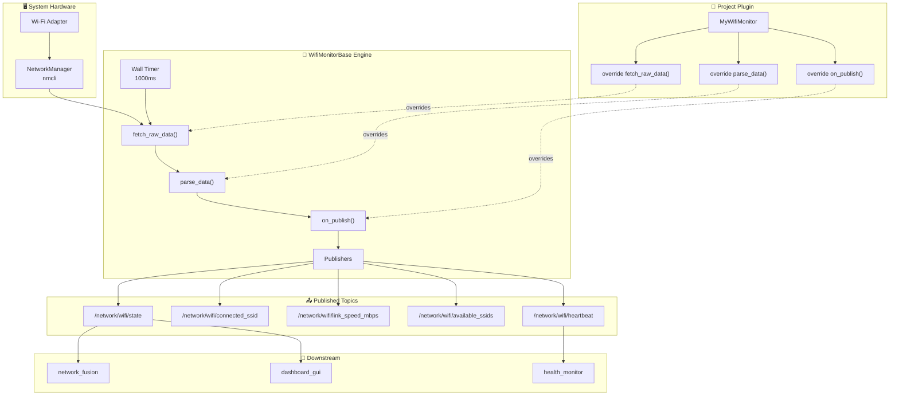

# 📶 wifi_network_monitor – Reusable Wi-Fi Monitor for ROS 2

[](https://docs.ros.org/)
[](https://en.cppreference.com/w/cpp/17)

A high-performance, reusable ROS 2 node that monitors the state of a system's Wi-Fi connection using Linux `nmcli` (or any command you choose).

Following a strict **Template Engine + Implementation Plug-in** architecture, it uses virtual hooks to allow any future project to reuse the core monitoring logic **without modifying a single line of the engine**.

---

## 🏗️ System Architecture

The node sits between the network interface and the high-level system controllers, providing a consistent Wi-Fi status feed to supervisors and safety monitors.



### Data Flow Overview

1. **Wi-Fi Hardware / Driver** – Provides raw network data via `nmcli` (or `iwconfig`, etc.).
2. **Wi-Fi Monitor Node** – Periodically polls the interface, parses the output, and publishes standardised status messages.
3. **Downstream Nodes** – Supervisor, Dashboard, and Mission Manager consume the topics for decision-making.

---

## 📂 Repository Architecture (The Template Pattern)

This package is split into two distinct layers to enforce separation of concerns:

```text
wifi_network_monitor/
├── include/
│   └── wifi_network_monitor/
│       └── wifi_monitor_base.hpp   ← 🧠 THE REUSABLE ENGINE
├── src/
│   └── wifi_monitor_node.cpp       ← 🚁 PROJECT-SPECIFIC PLUGIN
├── CMakeLists.txt
├── package.xml
└── README.md
```

| File | Role | Modify when... |
| :--- | :--- | :--- |
| `wifi_monitor_base.hpp` | Contains the class `WifiMonitorBase` with all publishers, timer, and virtual hooks | **Never.** This is the locked engine |
| `wifi_monitor_node.cpp` | Inherits from the base class and overrides hooks to customise command, parser, or side-effects | **Every time** you adapt the node to a different Wi-Fi tool or robot project |

---

## ✨ Key Features

- **🧬 Compile-Time Polymorphism via Virtual Hooks**  
  Override `fetch_raw_data()`, `parse_data()`, and `on_publish()` to adapt to any Wi-Fi tool without touching the engine. This satisfies the **Open/Closed Principle**.

- **🏭 Factory-like Registration**  
  The plugin simply inherits and overrides. No cumbersome type registries needed.

- **🛡️ Hard DDS QoS Enforcement**  
  The heartbeat publisher uses `liveliness` and `deadline` QoS to enable supervisors to detect node failure immediately.

- **🚫 Zero External Dependencies**  
  No YAML, no custom messages, no custom services – only standard `std_msgs`.

---

## 🚀 Quick Start

### 1. Build the Package

```bash
cd ~/ros2_ws
colcon build --packages-select wifi_network_monitor
source install/setup.bash
```

### 2. Run the Node

```bash
ros2 run wifi_network_monitor wifi_monitor_node
```

---

## ⚙️ Configuration Guide

Because this package follows a pure template architecture, all configuration is done at compile time by overriding virtual methods. No YAML file is needed.

### Available Virtual Hooks

| Hook | Purpose | Default Behaviour |
| :--- | :--- | :--- |
| `fetch_raw_data()` | Returns the command output (string) | Runs `nmcli -t -f ACTIVE,SSID,RATE,SECURITY dev wifi` |
| `parse_data(raw, state, ssid, avail, speed)` | Fills the output fields from the raw string | Parses `nmcli` colon-separated format |
| `on_publish(state)` | Called after every publish cycle | No action |

### Example: Switching from nmcli to iwconfig

```cpp
class MyWifiMonitor : public wifi_network_monitor::WifiMonitorBase
{
protected:
  std::string fetch_raw_data() override
  {
    return run_command("iwconfig 2>/dev/null | grep -E 'ESSID|Signal level'");
  }

  void parse_data(
    const std::string & raw,
    std::string & state,
    std::string & connected_ssid,
    std::string & available_ssids,
    int & speed_mbps) override
  {
    // Your custom parser for iwconfig output here
  }
};
```

---

## 🧑‍💻 Reusability Guide

To use the Wi-Fi Monitor in a different robot, **you do not modify the `.hpp` engine**.

### Step 1: Include the Template Engine

```cpp
#include "wifi_network_monitor/wifi_monitor_base.hpp"
```

### Step 2: Create a New Implementation Plug-in

```cpp
class TractorWifiMonitor : public wifi_network_monitor::WifiMonitorBase
{
public:
  TractorWifiMonitor() : WifiMonitorBase("tractor_wifi") {}

protected:
  std::string fetch_raw_data() override
  {
    return run_command("/opt/tractor/bin/get_wifi_status.sh");
  }
};

int main(int argc, char ** argv)
{
  rclcpp::init(argc, argv);
  rclcpp::spin(std::make_shared<TractorWifiMonitor>());
  rclcpp::shutdown();
  return 0;
}
```

That is it. **Zero modifications** to the original `.hpp` engine.

---

## 📡 Topic Interfaces

### Published Topics

| Topic | Type | Meaning |
| :--- | :--- | :--- |
| `/network/wifi/state` | `std_msgs/String` | `"CONNECTED"` or `"DISCONNECTED"` |
| `/network/wifi/connected_ssid` | `std_msgs/String` | Name of the network or `"--"` |
| `/network/wifi/link_speed_mbps` | `std_msgs/Int32` | Link speed in Mbps (`-1` if unknown) |
| `/network/wifi/available_ssids` | `std_msgs/String` | Comma-separated list of visible SSIDs |
| `/network/wifi/heartbeat` | `std_msgs/String` | Liveliness heartbeat for supervisor |

### Heartbeat QoS Settings

| Setting | Value |
| :--- | :--- |
| Reliability | Reliable |
| Deadline | 5000 ms |
| Liveliness | Manual by Topic |
| Lease Duration | 8000 ms |

---

## 🧪 Quick Test

Open two terminals to verify everything works:

```bash
# Terminal 1 — run the node
ros2 run wifi_network_monitor wifi_monitor_node

# Terminal 2 — check state topic
ros2 topic echo /network/wifi/state

# Terminal 2 — check connected SSID
ros2 topic echo /network/wifi/connected_ssid
```

---

## 🗂️ Related Modules

| Package | Purpose |
| :--- | :--- |
| `huawei_lte_http_monitor` | Huawei LTE stick via HTTP API |
| `lte_modem_monitor` | LTE interface monitoring via nmcli |
| `at_modem_monitor` | LTE modem monitoring via AT commands |
| `network_fusion` | Fuses all network link states into one status |
| `health_monitor` | Node and topic liveness checks |
| `supervisor_node` | Central decision maker |

---

## 🎓 Design Patterns Used

| Pattern | Implementation | Benefit |
| :--- | :--- | :--- |
| **Template Method** | `WifiMonitorBase` with virtual hooks | Reusable skeleton, project-specific filling |
| **Strategy Pattern** | `parse_data()` and `fetch_raw_data()` | Swap algorithms without changing class structure |
| **Observer Pattern** | DDS liveliness callbacks via `assert_liveliness` | Reactive failure detection |

---

## 📄 License

MIT License. Free to use for academic and commercial projects.
